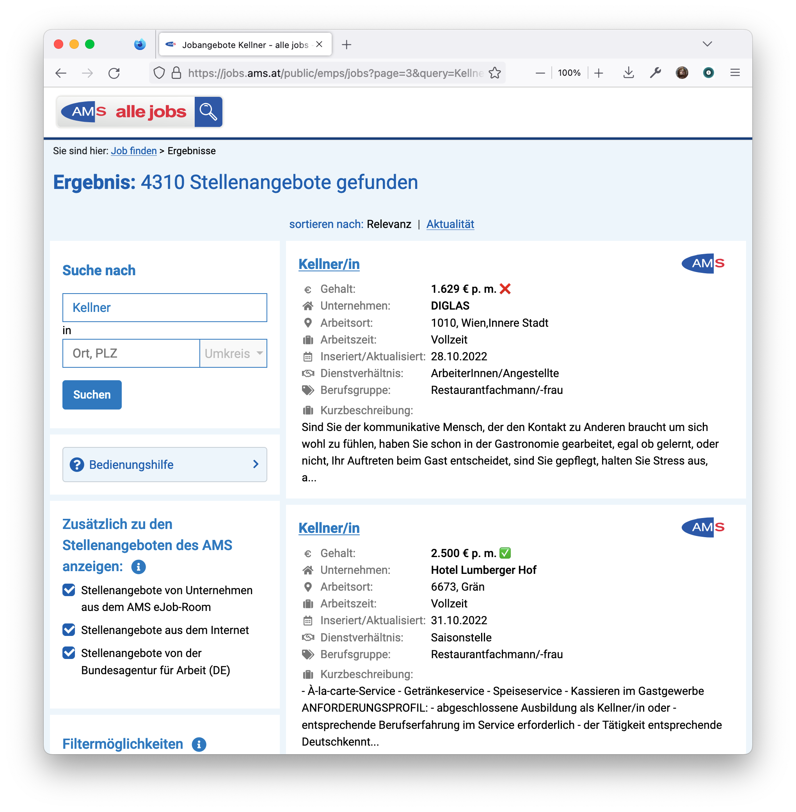

# AMSify
A Firefox and Chrome plugin to put the wage of each posting to its list entry.

The [AMS](https://www.ams.at/) keeps the largest list of open positions in 
Austria. However, you have to click on each one in the list to see the wage.
This extension for Firefox adds the wage to the list view so comparing positions
becomes easier.

<!-- FIXME: Add a try it now button/link -->

## Usage 
1) Install the extension in firefox or chrome
2) Visit [ams.at](https://jobs.ams.at/public/emps/) and search for any open position.

## Build it yourself
### Firefox
1) Goto [about:debugging#/runtime/this-firefox](about:debugging#/runtime/this-firefox)
2) Click on "Load Temporary Add-on..." and select the `manifest.json` in the addon folder.

### Chrome
1) Goto [chrome://extensions/](chrome://extensions/) and enable developer mode
2) Click on "Load Unpacked" and select `addon` folder.

## Contributing
We are happy for any contributions.

Please read our [Contributing](CONTRIBUTING.md) guidelines.

Thank you, you are awesome :tada: :blush:
